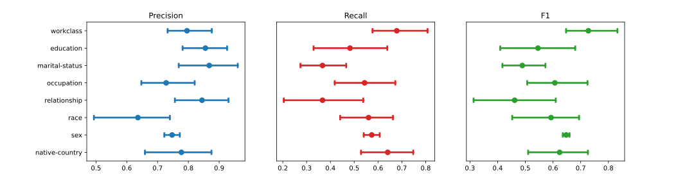

# Model Card - Salary Classification from Census Data

## Model Details
* Classifier that predicts whether income range based on census data.
* Random Forest Classifier
* Developed by **Jorge Luis Ledesma Ureña** for the Udacity ML DevOps Nanodegree Program in **September 2022**.

## Intended Use
* **Intended to be used to** predict whether income exceeds $50k/yr based on demographical data.
* **Applications** range from loan and credit approvals to financial and insurance risk evaluations.
* **Not intended to** make judgements about specific individuals.

## Training and Evaluation Data
* **Data Source:** UCI Machine Learning Repository, Census Income Data Set.
    * Information: https://archive.ics.uci.edu/ml/datasets/census+income
    * Dataset (CSV): https://archive.ics.uci.edu/ml/machine-learning-databases/adult/adult.data
* An **80-20 train-test** split was performed using Scikit-Learn's `train_test_split` function, with a **random state** of 0.

## Metrics
* Performance was evaluated with metrics including **Precision**, **Recall**, and **F1-score**.
* Together, these metrics provide values for different errors that can be calculated from the confusion matrix for binary classification systems.
* The **overall performance** evaluation lead to the following metrics:
    * Precision: 0.7285
    * Recall: 0.5969
    * F1-score: 0.6562
* **Slice-based performance** was determined with the same metrics for the different categorical features.

## Quantitative Analyses
95% confidence intervals calculated with bootstrap resampling:

## Ethical Considerations
* Data based on public US census data.
* No new information is inferred or annotated.

## Caveats and Recommendations
* Improvements to be considered in the modeling process include: model selection process, k-fold cross-validation, and hyperparameter tuning.
* Race range of precisions indicate bias in race distribution. Training and evaluation data should reflect more homogeneity in this aspect.